# Altium Library

This library is a copy of excellent [Celestial Altium Library](https://github.com/issus/altium-library).
The primary objective in undertaking this project is independent development.

### Advantages
- One full library with standardized components
- No need for different Altium plugins for development
- Every day synchronization
- Automated updates from different sources
- Offline development support
- Single `git pull` and library is up to date

### How it works

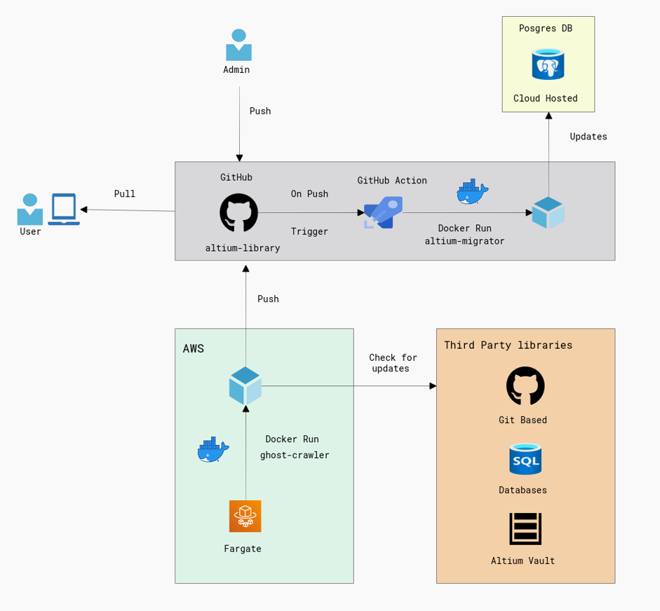

1. Library has been updated in two ways:
    - ***Manually:*** by admin and developers.
    - ***Automatically:*** by `ghost-crawler`, which integrates with different platforms, compares actual database 
      and creates pull requests when new data has been arrived.
2. All database changes are stored in `migration` folder as `SQL` scripts. This serves as historical data for DB version control
3. After all pushes to the `main` branch, the CI/CD pipeline runs the [altium-migrator](https://github.com/ximtech/altium-migrator) updating the database

### How to use it

#### Clone repository
1. `git clone https://github.com/ximtech/altium-library.git`

### Configure ODBC drivers for PostgreSQL

#### Offline development configuration
1. Download and install Postgres for local development [here](https://www.postgresql.org/download/windows/) -> `Download the installer`.
  - Download and install PgAdmin tool from [here](https://www.pgadmin.org/).
  - Create empty Database:
  - 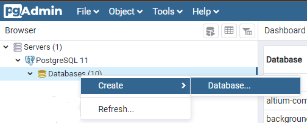
  - In `Database` field write: `altium-components` -> `Save`
   
2. Download pSQLODBC_x64 Driver from [this](https://www.postgresql.org/ftp/odbc/versions/) location.
  We are configuring the ODBC driver for Windows 10 or later, so we are going to download the MSI file of the Driver. Click on the MSI folder.
    - 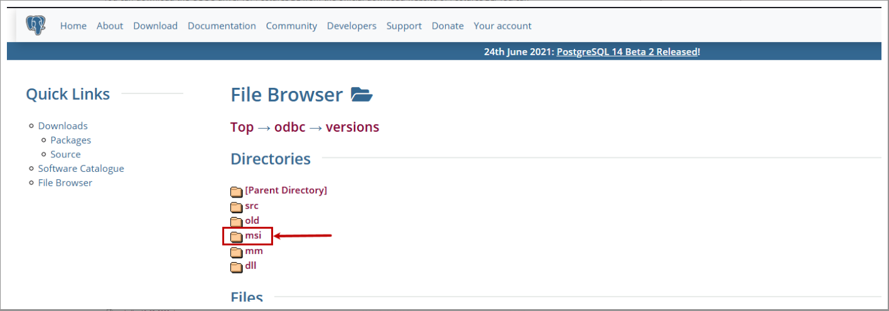
3. Under the MSI directory, you can view the various versions of Driver. The files are compressed in zip format. 
      We want to download the latest version, so scroll down to the bottom of the page and click on the `psqlodbc_13_01_0000-x64.zip` file.
   - 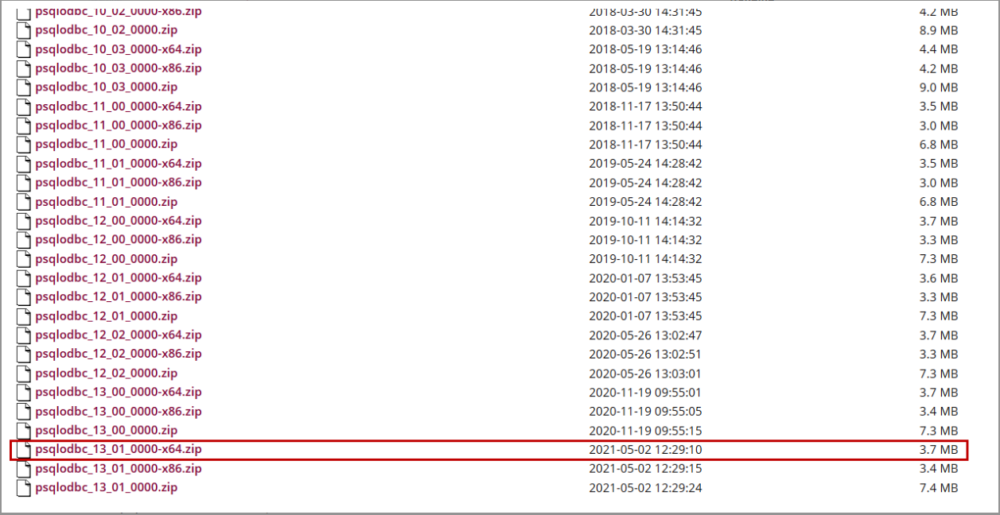
4. Once download completes, right-click on `psqlodbc_13_01_0000-x64.zip` file and select Extract to `psqlodbc_13_01_0000-x64` option.
    - 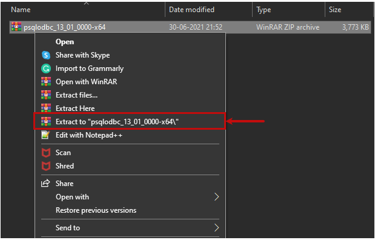
5. Install the psqlODBC_x64 driver. When we run the MSI file, the pSQLODBC_x64 diver setup wizard begins. On the first screen, you can see the details of the wizard. Click `Next`.
    - 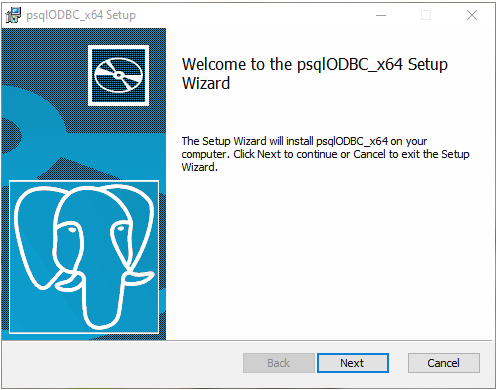
6. Then click on I accept the terms in the license agreement
7. On the ***Custom Setup*** screen, you can select the feature of the drivers. Click `Next`.
8. On ***Ready to install*** screen, click on the `Install` button.

#### Configure pSQLODBC_x64 Driver using System DSN
1. Press `Start Button` and write `ODBC`.
    - 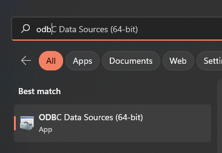
2. Open ODBC Data Source (64–bit) -> Click on System DSN tab -> Click on Add.
    - 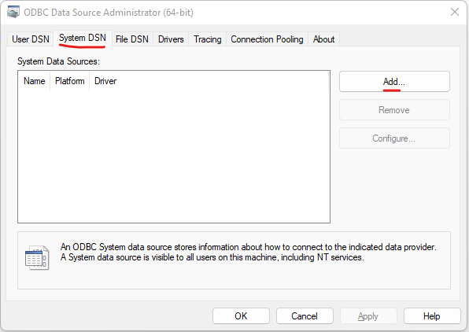
3. A dialog box Create a new data source opens. Select PostgreSQL Unicode(x64) driver and click on Finish.
    - 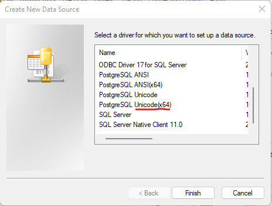
4. Configure parameters as follows and press `Test` button.
    - 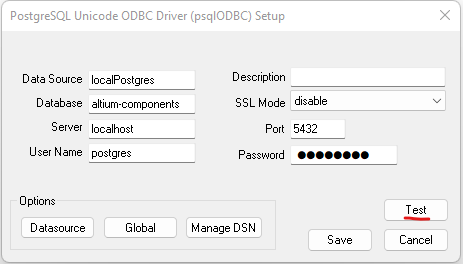
5. Verify the connectivity.
    - 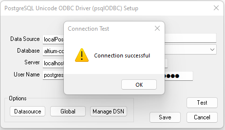
6. Click on Save to create the system DSN. Back to the System DSN screen, you can see the `localPostgres` DSN has been created.

#### Populate Database using migration tool
1. Go to [altium-migrator](https://github.com/ximtech/altium-migrator#how-to-use-it) and follow instructions.
2. At this point, tip `5` can be skipped in `altium-migrator` manual, because database already has been installed.
3. If all ok, move to the next step

#### Add library to Altium
1. Open `Altium designer` -> `Components` -> `File-based Libraries Preferences` -> `Install`
2. Go to `altium-library` folder then choose:
    - 
3. Additionally, verify connection settings by pressing `Advanced...` button
    - 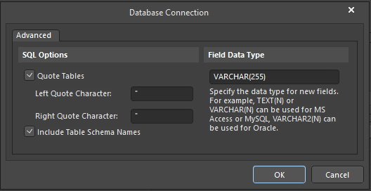

## For already existing database
1. Skip first tip at `Offline development configuration` manual
2. In `Configure pSQLODBC_x64 Driver using System DSN` set your DB datasource values(host, port, username and password)
3. Populate DB using [altium-migrator](https://github.com/ximtech/altium-migrator) tool
3. Then in `altium-library` folder open `Postgres Altium Library - altium_library.DbLib` with notepad and change `ConnectionString`(4th line) with custom DB parameters
